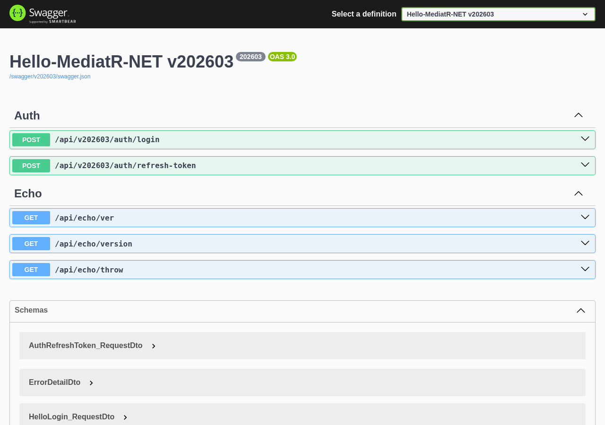

[](https://github.com/osisdie/dotnet-mediatr-boilerplate/actions/workflows/dotnet.yml)
[](https://dotnet.microsoft.com)
[](LICENSE)
[](Dockerfile)
[](https://github.com/osisdie/dotnet-mediatr-boilerplate/commits/main)

# dotnet-mediatr-boilerplate

A production-ready **.NET 10.0** WebAPI boilerplate showcasing **Clean Architecture** with MediatR (CQRS), FluentValidation, JWT authentication, versioned Swagger/OpenAPI, email notifications via MailKit, Docker containerization, Kubernetes deployment, Azure Pipelines CI/CD, and xUnit testing.

## Table of Contents

- [Features](#features)
- [Project Architecture](#project-architecture)
- [Quick Start](#quick-start)
- [Environment Variables](#environment-variables)
- [API Documentation](#api-documentation)
- [Testing](#testing)
- [Deployment](#deployment)
- [Contributing](#contributing)
- [License](#license)

## Features

- CQRS pattern with **MediatR**
- Request validation with **FluentValidation**
- **JWT Bearer** authentication (access + refresh tokens)
- Versioned **Swagger/OpenAPI** UI (v202303, v202203, v202103)
- Email notifications via **MailKit**
- Object mapping with **AutoMapper**
- Multi-stage **Docker** build
- **Kubernetes** deployment manifests (minikube)
- **Azure Pipelines** + **GitHub Actions** CI
- **xUnit** test projects with coverlet coverage
- Multi-environment configuration (Debug, Development, Testing, Staging, Production)
- Built-in **Health Check** endpoint (`/health`)
- Request/Response logging middleware
- `.editorconfig` for consistent code style

## Project Architecture

```
src/
  Endpoint/
    HelloMediatR/                  # WebAPI entry point (net10.0)
    Contracts/HelloMediatR/        # Domain contracts & validators
  Library/
    CoreFX/
      Abstractions/                # Core abstractions & configuration
      Auth/                        # JWT authentication services
      DataAccess/Mapper/           # AutoMapper extensions
      Hosting/                     # Middleware & DI extensions
      Http/                        # HTTP client helpers
      Notification/                # MailKit email service
    HelloMediatR/
      DataAccess/                  # EF Core InMemory database context
      SDK/                         # Domain services & business logic
tests/
  TestAbstractions/                # Shared test infrastructure
  UnitTest/CoreFX/                 # CoreFX unit tests
  UnitTest/HelloMediatR/           # MediatR unit tests
deploy/
  azure-pipelines.yml              # Azure DevOps CI/CD pipeline
minikube/                          # Local Kubernetes manifests
```

## Quick Start

### Prerequisites

- [.NET 10.0 SDK](https://dotnet.microsoft.com/download)
- [Docker](https://www.docker.com/) (optional)

### Run Locally

```bash
git clone https://github.com/osisdie/dotnet-mediatr-boilerplate.git
cd dotnet-mediatr-boilerplate

dotnet restore hello-mediatR-all-projects.sln
dotnet run --project src/Endpoint/HelloMediatR/Hello.MediatR.Endpoint.csproj
```

Open [http://localhost:5000/swagger](http://localhost:5000/swagger) to explore the API.

### Run with Docker

```bash
docker build -t hello-mediatr-api -f Dockerfile .
docker run -d -p 5000:80 -e ASPNETCORE_ENVIRONMENT=Development hello-mediatr-api
```

Open [http://localhost:5000/swagger](http://localhost:5000/swagger) to explore the API.



## Environment Variables

| Variable | Description | Example Values |
|----------|-------------|----------------|
| `ASPNETCORE_ENVIRONMENT` | Runtime environment | `Debug`, `Development`, `Testing`, `Staging`, `Production` |
| `COREFX_API_NAME` | API service identifier | `hello-mediatr-api-debug` |
| `COREFX_SMTP_PWD` | SMTP password for email service | *(secret - use Secret Manager)* |

## API Documentation

The API exposes three versioned Swagger UI endpoints:

| Version | Endpoint |
|---------|----------|
| v202603 | `/swagger/v202603/swagger.json` |
| v202303 | `/swagger/v202303/swagger.json` |
| v202203 | `/swagger/v202203/swagger.json` |
| v202103 | `/swagger/v202103/swagger.json` |

Health check: `GET /health`

## Testing

```bash
export ASPNETCORE_ENVIRONMENT=Debug
export COREFX_API_NAME=hello-mediatr-api-debug

dotnet test hello-mediatR-all-projects.sln -c Release
```

Expected: All tests pass in less than 1 minute.

## Deployment

### Docker

See [Quick Start](#run-with-docker) above. The multi-stage Dockerfile uses `mcr.microsoft.com/dotnet/aspnet:10.0` as the runtime image.

### Azure Pipelines

The CI/CD pipeline is defined in [`deploy/azure-pipelines.yml`](deploy/azure-pipelines.yml). It builds, tests, and optionally pushes Docker images to AWS ECR.

### Kubernetes (minikube)

Local Kubernetes deployment manifests are in the [`minikube/`](minikube/) directory:

```bash
kubectl apply -f minikube/deployment.yaml
kubectl apply -f minikube/service.yaml
kubectl apply -f minikube/ingress.yaml
```

## Contributing

Contributions are welcome! Please read [CONTRIBUTING.md](CONTRIBUTING.md) for guidelines.

## License

This project is licensed under the [MIT License](LICENSE).

## Changelog

See [CHANGELOG.md](CHANGELOG.md) for version history.
